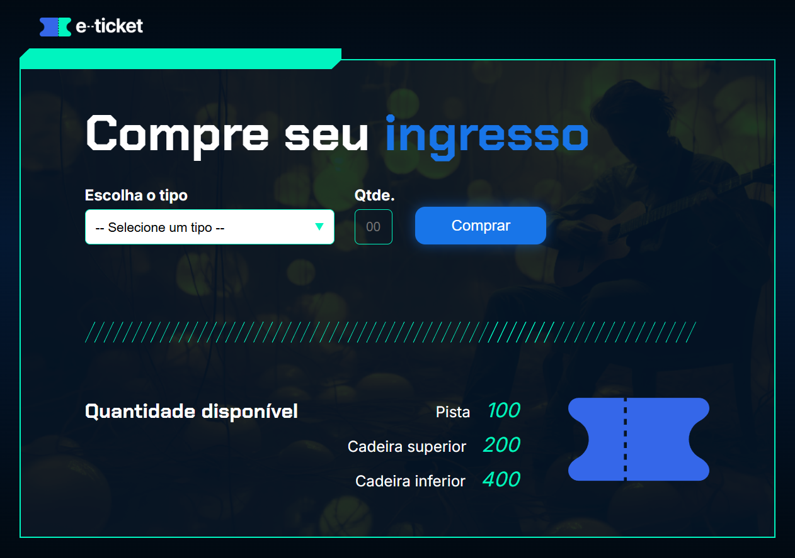

# Compra de Ingressos

Uma aplicação web simples e intuitiva para simular a compra de ingressos para eventos. Este projeto foi desenvolvido com foco em praticar habilidades de front-end, incluindo HTML, CSS e JavaScript, e oferece uma interface amigável para os usuários selecionarem o tipo de ingresso e a quantidade desejada.

---

## Menu

- [Layout](#layout)
- [Descrição](#descrição)
  - [Principais recursos incluem](#principais-recursos-incluem)
- [Tecnologias Utilizadas](#tecnologias-utilizadas)
- [Estrutura de Pastas](#estrutura-de-pastas)
  - [Arquivos Principais](#arquivos-principais)
- [Como Instalar e Rodar o Projeto](#como-instalar-e-rodar-o-projeto)
  - [Configuração](#configuração)
  - [Casos de Uso Comuns](#casos-de-uso-comuns)
  - [Solução de Problemas](#solução-de-problemas)
- [Projeto ao Vivo](#projeto-ao-vivo)
- [Licença](#licença)
- [Autor](#autor)

---

## Layout



---

## Descrição

A aplicação "Compra de Ingressos" permite que os usuários escolham entre diferentes tipos de ingressos (pista, cadeira superior e cadeira inferior) e selecionem a quantidade desejada, com base na disponibilidade. O sistema atualiza automaticamente a quantidade restante de ingressos após cada compra e exibe mensagens de sucesso ou alerta caso a quantidade solicitada não esteja disponível.

### Principais recursos incluem

- Interface responsiva e amigável.
- Seleção de tipo de ingresso com menu suspenso.
- Validação de quantidade disponível antes da compra.
- Atualização dinâmica da quantidade de ingressos restantes.
- Alertas para feedback do usuário.

---

## Tecnologias Utilizadas

- **HTML5**: Estrutura semântica da página.
- **CSS3**: Estilização com foco em design moderno e responsivo.
- **JavaScript**: Lógica de interação e manipulação dinâmica do DOM.

---

## Estrutura de Pastas

```plaintext
ingresso/
├── assets/                     # Pasta de assets
|   ├── PNG/                    # Pasta de imagens PNG
|   ├── SVG/                    # Pasta de imagens SVG
|   ├── image1.png              # Imagem de fundo
|   ├── ingresso.svg            # Imagem do ingresso
|   └── Logo-e-ticket.png       # Imagem do Logo do e-Ticket
├── js/                         # Scripts
|   └── app.js                  # Script com as funções do projeto
├── screenshot/                 # Screenshot
|   └── tela-principal.png      # Print do Projeto
├── styles/                     # Estilos CSS
|   ├── _reset.css              # Reset CSS para limpar o estilo do navegador
|   └── style.css               # Estilo do projeto
├── index.html                  # Página principal
├── LICENSE                     # Arquivo de LICENÇA MIT
└── README.md                   # Arquivo README do projeto
```

### Arquivos Principais

- **index.html**: Estrutura principal da aplicação.
- **styles/\_reset.css**: Reset de estilos para consistência entre navegadores.
- **styles/style.css**: Estilos personalizados para o layout.
- **js/app.js**: Lógica de compra e manipulação de estoque.

---

## Como Instalar e Rodar o Projeto

### Configuração

1. Clone o repositório:

```bash
git clone https://github.com/Melksedeque/compra-ingressos.git
```

2. Abra o arquivo index.html no navegador.

### Casos de Uso Comuns

- Simular a compra de ingressos para eventos.
- Testar a lógica de validação de estoque.

### Solução de Problemas

- Certifique-se de que todos os arquivos estão no mesmo diretório e que os caminhos para os recursos (imagens, CSS, JS) estão corretos.
- Caso o JavaScript não funcione, verifique se o navegador está com o suporte a scripts habilitado.

---

## Projeto ao Vivo

Você pode ver o projeto ao vivo neste link: [https://melksedeque.github.io/compra-ingressos/](https://melksedeque.github.io/compra-ingressos/)

---

## Licença

Este projeto está licenciado sob a Licença MIT. Veja o arquivo [LICENSE](https://github.com/Melksedeque/compra-ingressos?tab=MIT-1-ov-file) para mais detalhes.

---

## Autor

- GitHub - [Melksedeque Silva](https://github.com/Melksedeque/)
- FrontEndMentor - [@Melksedeque](https://www.frontendmentor.io/profile/Melksedeque)
- Twitter / X - [@SouzaMelk](https://x.com/SouzaMelk)
- LinkedIn - [Melksedeque Silva](https://www.linkedin.com/in/melksedeque-silva/)
